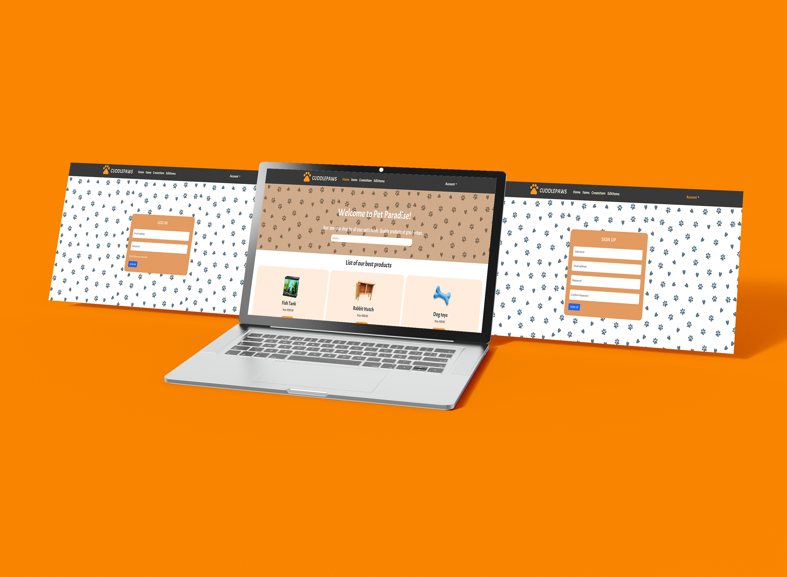
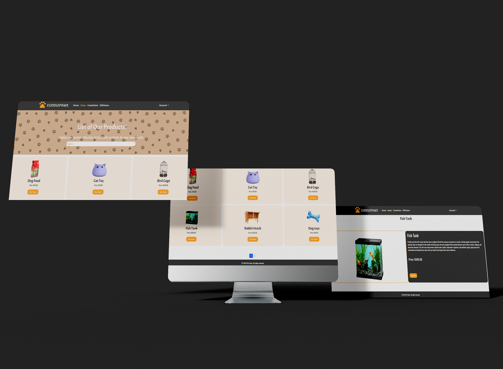
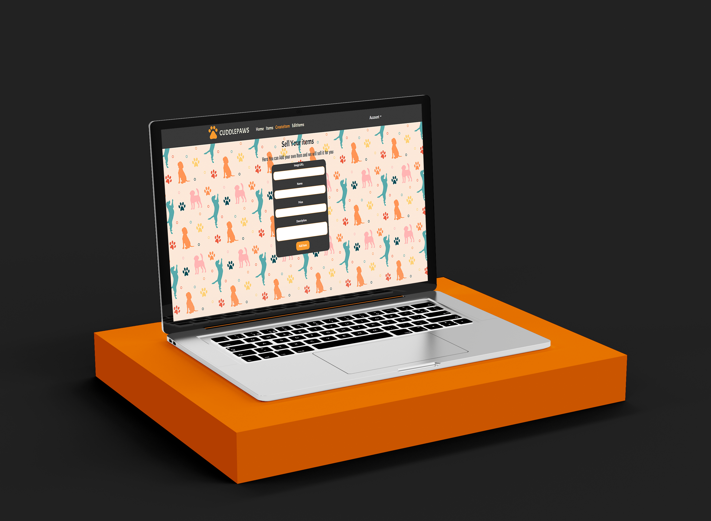
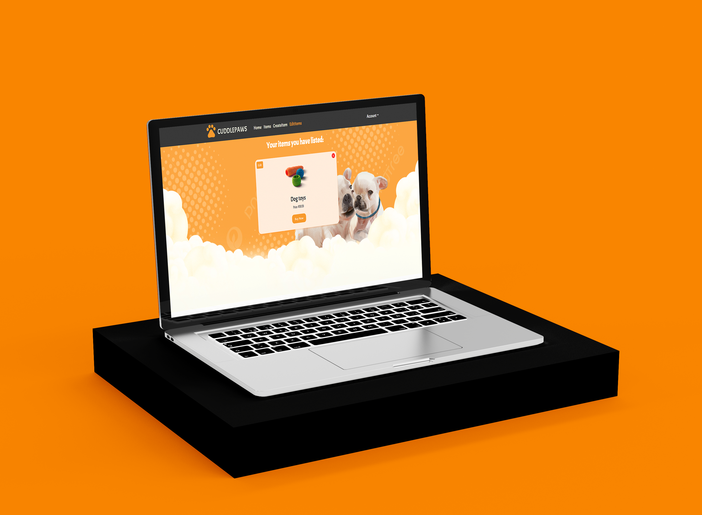

## Table of Contents

* [About the Project](#about-the-project)
   * [Home, Sign In and Sign Up](#home-sign-in-and-sign-up)
   * [Items](#items)
   * [Create Items](#create-items)
   * [Edit Items](#edit-items)
* [Getting Started](#getting-started)
  * [Backend](#backend)
  * [Frontend](#frontend)
  * [Setup](#setup)
    * [Backend Setup](#backend-setup)
    * [Frontend Setup](#frontend-setup)
  * [Running the Project](#running-the-project)
    * [Running the Backend](#running-the-backend)
    * [Running the Frontend](#running-the-frontend)
* [Built With](#built-with)
* [Contributing](#contributing)
* [Authors](#authors)
* [License](#license)
* [Demo Recording](#demo-recording)

## About The Project

The objective of this project is to develop a comprehensive and user-friendly pet store website that allows users to buy and sell pet-related items. The platform aims to cater to pet owners and pet enthusiasts, providing a marketplace for various pet supplies such as food, toys, accessories, and more. MongoDB will be used as the primary database for storing and managing data related to products, users, orders, and other essential aspects of the website.

### Home, Sign In and Sign Up



### Items



### Create Items



### Edit Items



## Getting Started

These instructions will get you a copy of the project up and running on your local machine for development and testing purposes.

### Backend

1. Clone the repository:

    ```sh
    git clone https://github.com/your-username/cuddle-paws.git
    cd cuddle-paws/backend
    ```

2. Install backend dependencies:

    ```sh
    npm install npm install bcryptjs cors dotenv express mongodb mongoose nodemon
    ```

### Frontend

1. Navigate to the frontend directory:

    ```sh
    cd ../cuddlepaws
    ```

2. Install frontend dependencies:

    ```sh
    npm install @hookform/resolvers @testing-library/jest-dom @testing-library/react @testing-library/user-event axios bootstrap bootstrap-icons react react-bootstrap react-dom react-hook-form react-icons react-router-dom react-scripts react-spinners web-vitals yup
    ```

## Setup

### Backend Setup

1. Create a `.env` file in the `backend` directory and add the following environment variables:

    ```env
    MONGO_URI=your_mongodb_connection_string
    JWT_SECRET=your_jwt_secret_key
    ```

2. Ensure your MongoDB server is running. You can start MongoDB with the following command:

    ```sh
    mongod
    ```

### Frontend Setup

1. Create a `.env` file in the `frontend` directory and add the following environment variables:

    ```env
    REACT_APP_API_URL=http://localhost:5000
    ```

## Running the Project

### Running the Backend

1. Start the backend server:

    ```sh
    cd backend
    npm start
    ```

    The backend server will run on `http://localhost:5000`.

### Running the Frontend

1. Start the frontend development server:

    ```sh
    cd cuddlepaws
    npm start
    ```

    The frontend server will run on `http://localhost:3000`.

## Built With

* [JavaScript](https://developer.mozilla.org/en-US/docs/Web/JavaScript)
* [React](https://react.dev/)
* [Bootstrap](https://getbootstrap.com/)
* [MongoDB](https://www.mongodb.com/)

## Contributing

Contributions are what make the open source community such an amazing place to be learn, inspire, and create. Any contributions you make are **greatly appreciated**.

1. Fork the Project
2. Create your Feature Branch (`git checkout -b feature/AmazingFeature`)
3. Commit your Changes (`git commit -m 'Add some AmazingFeature'`)
4. Push to the Branch (`git push origin feature/AmazingFeature`)
5. Open a Pull Request

## Authors

* **CuddlePaws** - *JavaScript, HTML, CSS, React, & MongoDB* - [CuddlePaws](https://github.com/CuddlePaws)

## License

This project is licensed under the MIT License - see the [LICENSE.md](LICENSE.md) file for details.

## Demo Recording
