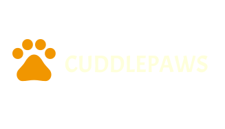

## Table of Contents

* [About the Project](#about-the-project)
   * [Home](#home)
   * [Items](#items)
   * [CreateItems](#createitems)
   * [EditItems](#edititems)
   * [SignIn](#signin)
   * [SignUp](#ignup)
* [Getting Started](#getting-started)
  * [Install all dependencies](#install-all-dependencies)
  * [Installing](#installing)
* [Built With](#built-with)
* [Contributing](#contributing)
* [Authors](#authors)
* [License](#license)
* [Vlog](#vlog)

## About The Project

The objective of this project is to develop a comprehensive and user-friendly pet store website that allows users to buy and sell pet-related items. The platform aims to cater to pet owners and pet enthusiasts, providing a marketplace for various pet supplies such as food, toys, accessories, and more. MongoDB will be used as the primary database for storing and managing data related to products, users, orders, and other essential aspects of the website.

### Home


### Items

### CreateItems

### EditItems

### SignIn

### SignUp


## Getting Started

These instructions will get you a copy of the project up and running on your local machine for development and testing purposes.

 ### Install all dependencies
- 
### Installing

1. Clone the repo
```sh
git clone https://github.com/ZanderBez/Individual-Assessment
```
2. Open the project

Use `Open Workspace` in Visual Studio.

## Built With

* [Javascript](https://developer.mozilla.org/en-US/docs/Web/JavaScript)
* [React](https://react.dev/)
* [Bootstrap](https://getbootstrap.com/)
* [MongoDB](https://www.mongodb.com/lp/cloud/atlas/try4?utm_source=google&utm_campaign=search_gs_pl_evergreen_atlas_core_prosp-brand_gic-null_emea-za_ps-all_desktop_eng_lead&utm_term=mongodb&utm_medium=cpc_paid_search&utm_ad=e&utm_ad_campaign_id=12212624560&adgroup=115749711783&cq_cmp=12212624560&gad_source=1&gclid=CjwKCAjwjeuyBhBuEiwAJ3vuobDAOofPUDN8CCzq495-xxmQl8uIufH4CvvunnNGboR6IoZQ9UILBBoCgQUQAvD_BwE)


## Contributing

Contributions are what make the open source community such an amazing place to be learn, inspire, and create. Any contributions you make are **greatly appreciated**.

1. Fork the Project
2. Create your Feature Branch (`git checkout -b feature/AmazingFeature`)
3. Commit your Changes (`git commit -m 'Add some AmazingFeature'`)
4. Push to the Branch (`git push origin feature/AmazingFeature`)
5. Open a Pull Request

## Authors

* **Zander Bezuidenhout** - *Javascript, HTML ,CSS, React, & MongoDB* - [ZanderBezuidenhout](https://github.com/ZanderBez)


## License

This project is licensed under the MIT License - see the [LICENSE.md](LICENSE.md) file for details.


## Demo Recording 

